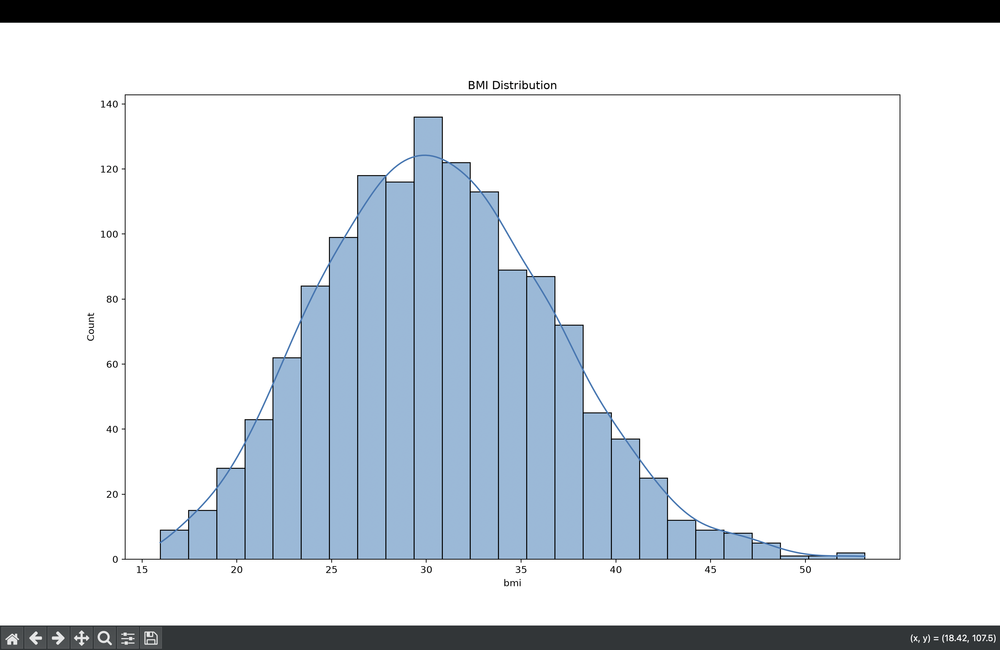
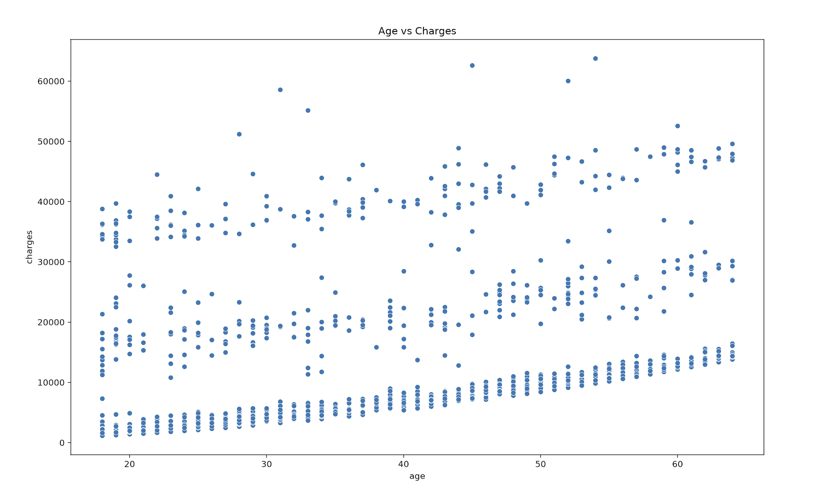
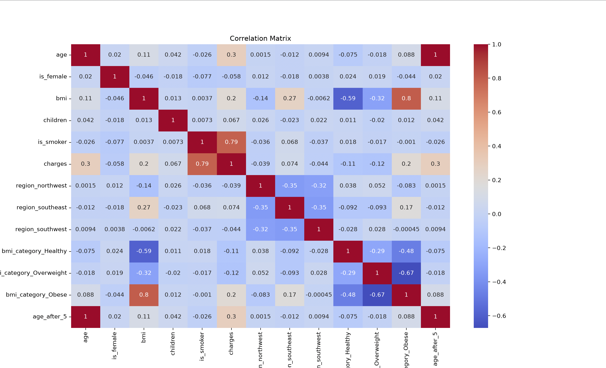
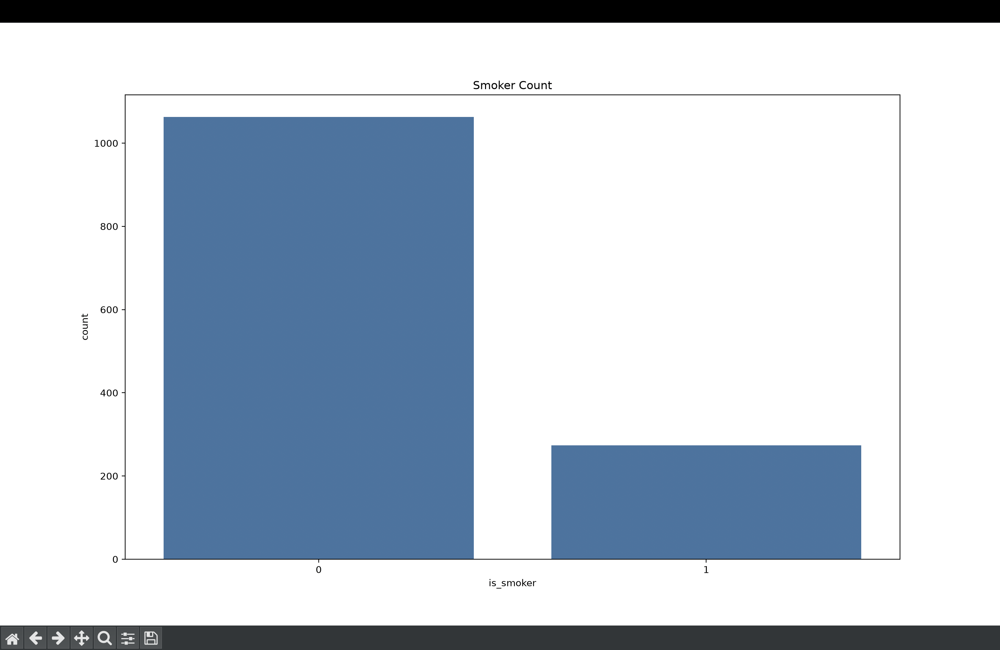
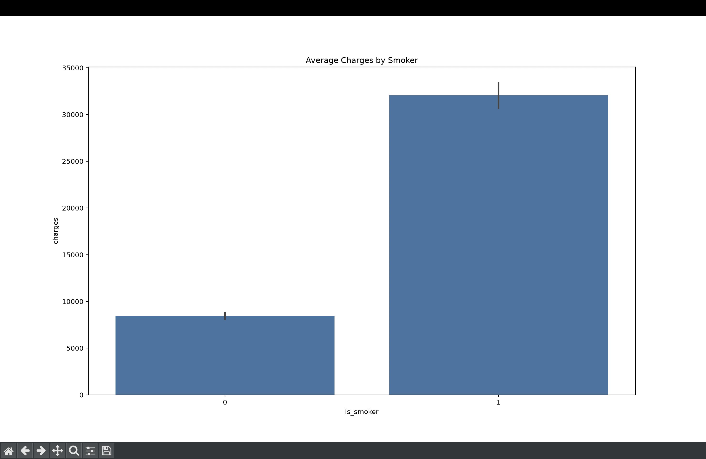
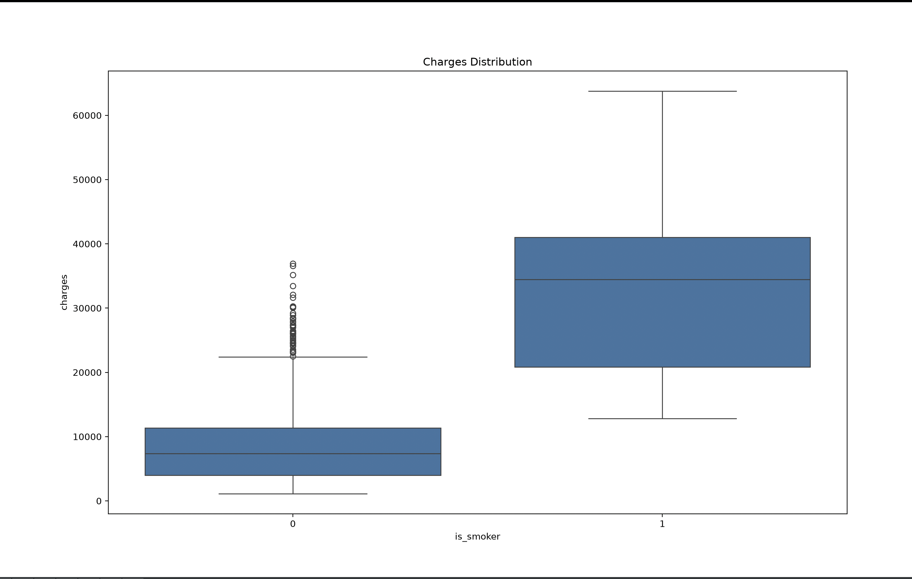
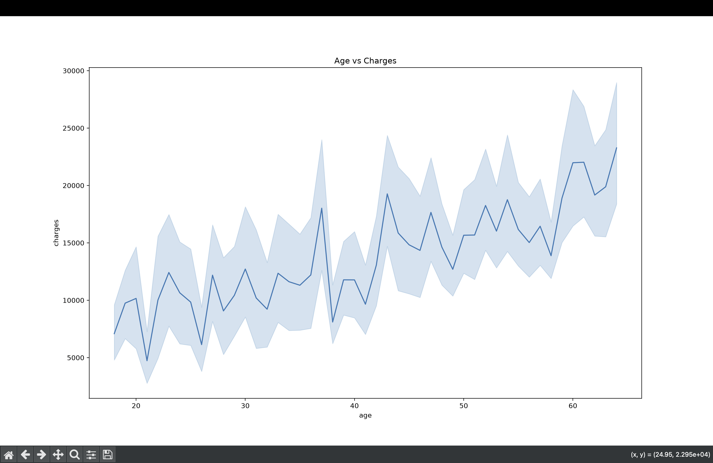

# Insurance Charges Prediction using Machine Learning

## Overview

This project predicts medical insurance charges using Machine Learning.

The project covers the complete ML workflow:

- Data Cleaning
- Exploratory Data Analysis (EDA)
- Feature Engineering
- Data Visualization
- Linear Regression
- Model Evaluation
- Prediction on New Data
- Saving and Loading Models

---

## Technologies

- Python
- Pandas
- NumPy
- Matplotlib
- Seaborn
- Scikit-learn
- Joblib

---

## Dataset

Insurance Dataset

Features

- Age
- Gender
- BMI
- Children
- Smoker
- Region

Target

- Insurance Charges

---

## Model

Linear Regression

Evaluation

- MAE
- MSE
- RMSE
- R² Score

Achieved

- R² Score = **0.8025**

---

## Project Structure

```text
insurance-charge-prediction/
│
├── data/
├── model/
├── images/
├── eda.py
├── predict.py
├── README.md
└── requirements.txt
```
## BMI Distribution



---

## Age vs Charges



---

## Correlation Heatmap



---

## Smoker Count



---

## Average Charges by Smoker



---

## Charges Distribution



---

## Line Plot


## 👨‍💻 Author

**Subodh Kumar Yadav**

B.Tech CSE, NIT Silchar